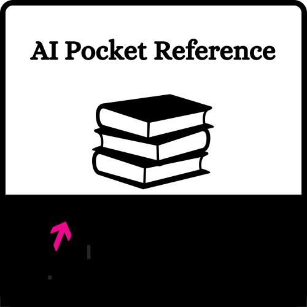

# AI Pocket Reference

<!-- markdownlint-disable MD033 -->

<p align="center">
  
</p>

<!-- markdownlint-enable MD033 -->

A streamlined reference manual providing concise information about artificial intelligence
fundamentals, as well as areas such as computer vision, natural language processing,
reinforcement learning, federated learning, and responsible AI.

📚 **Read the Pocket Reference: [vectorinstitute.github.io/ai-pocket-reference](https://vectorinstitute.github.io/ai-pocket-reference/)**

## Overview

The AI Pocket Reference project is maintained by Vector AI Engineering as an accessible
resource for the AI community. It is built using the [mdBook](https://rust-lang.github.io/mdBook/)
tool and serves as a quick reference guide for essential AI concepts, making it
easier to find and understand key information without diving into lengthy documentation.

## What is a Pocket Reference?

A Pocket Reference is designed to be both an entry point for newcomers and a quick
refresher for experienced practitioners. Core characteristics include:

- Concise explanations of AI concepts and jargon terms
- Each pocket reference is no longer than 7 minutes of calculated reading time
- Includes curated links to further readings and resources

To enhance understanding, some pocket references may also include:

- Illustrative diagrams
- Links to supplementary sample code

Whether you're learning a topic for the first time or need to quickly refresh your
understanding, each reference serves as both a starting point and a gateway to
deeper knowledge through carefully selected additional resources. The AI Pocket
References are actively maintained, with new references being added to stay relevant
with the evolving field of AI.

## Community

We believe in building and maintaining this resource together with the AI community.
You can help improve the AI Pocket Reference by:

- [Creating an issue](https://github.com/VectorInstitute/ai-pocket-reference/issues/new/choose)
  to suggest improvements or request new topics
- Joining discussions about AI concepts and pocket references in our
  [Discussion Board](https://github.com/VectorInstitute/ai-pocket-reference/discussions)

Your insights and feedback help make this resource more valuable for everyone in
the AI community.

## Contributing

We welcome contributions from the AI community! If you'd like to write a new pocket
reference or help improve existing ones, please see our [CONTRIBUTING.md](CONTRIBUTING.md)
file for detailed guidelines.

## License

AI Pocket Reference © 2025 by Vector Insitute (AI Engineering) is marked with
CC0 1.0. See the [LICENSE](LICENSE) file for details.

## Citation

While this work is released under CC0 1.0 and citation is not required, if you would
like to reference the AI Pocket Reference in your work, you can cite it as:

```bibtex
@misc{vector_ai_pocket_reference,
  author = {{Vector Institute - AI Engineering}},
  title = {AI Pocket Reference},
  year = {2024},
  url = {https://vectorinstitute.github.io/ai-pocket-reference},
  doi = {10.5281/zenodo.XXXXXX}
}
```

---

Maintained by Vector AI Engineering
